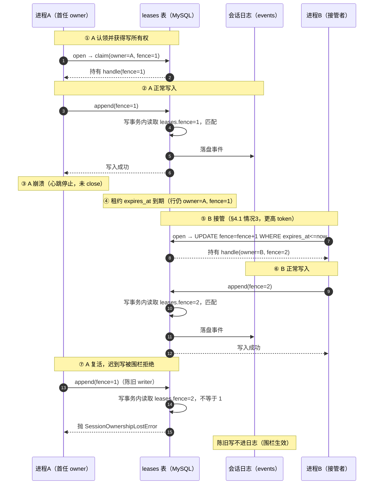

# 跨进程租约模式设计文档 —— dsh-session-persistence-mysql

> **状态：设计先行（status: design），当前未实现。** 本文件描述在现有"单实例 Provider"之上新增一个 **opt-in 的 cluster/lease 模式**，使多个 `web` profile 实例（不同机器）共享同一 MySQL 后端时，对任一会话只有一个实例能驱动其 turn，且不依赖 dsh 核心改动。
>
> 任何偏离本文件的行为都应先修订本文件。实现阶段以本文为唯一权威来源，逐节核对设计约定。

## 1. 背景与动机

### 1.1 现状（代码核对结论）

`dsh-session-persistence-mysql` 当前是 `dsh-session-persistence` 接缝的 **MySQL Provider**，与 `dsh-session-persistence-jsonl` 行为契约等价（见 `docs/DESIGN.md` §1、§3）。其跨进程安全仅来自 InnoDB 行锁对 `append` 的串行化：

- `open('write')` 仅在**进程内** `MysqlBackendTracker.writers: Map` 中登记（`src/index.ts:226` → `src/mysql-handle.ts:429` `claimWrite`），**不查询也不认领 MySQL 侧所有权**。
- `append` 并发靠 `persistBatchOnce` 的 `SELECT … FOR UPDATE` 行锁 + `log_rev+1` + 复合主键重复键（errno 1062）兜底（`src/mysql-backend.ts` 的 `persistBatchOnce`）。当前重复键有**两种不同**结果：(a) **同 seq 不同内容** → 抛普通 `Error`（真冲突，`:418` 附近）；(b) **同 seq 同内容** → 幂等 no-op（at-least-once 重放）。**二者都不是** `SessionOwnershipLostError`——后者只用于“围栏失效/所有权已丢”。
- `log_rev` 是 per-session append 计数，**不是 per-owner epoch（围栏令牌）**；无 `leases` 表、无 TTL、无心跳。

### 1.2 问题

集群多实例（不同机器）场景下，两个实例可**同时** `open('write')` 同一会话并各自驱动 turn → 会话日志并发写冲突、崩溃实例不自动释放。这违背了 dsh 核心对 `SessionPersistence` 接缝"单写者所有权"的语义承诺（核心 README 明言 *cross-process exclusion is provider-specific*）。

### 1.3 目标

在**不改 dsh 核心、不新建后端**的前提下，补一层"分布式租约 + 围栏令牌"，让本插件成为一个忠实的分布式子类：
- `open('write')` / `create` 在 MySQL 层**原子认领**单写者所有权，被他人持有且未过期 → 抛既有 `SessionAlreadyOwnedError`。
- `append` / `flush` 在写事务内**校验围栏令牌**，令牌不符（陈旧 owner / 已失锁）→ 抛既有 `SessionOwnershipLostError`。
- 崩溃/失活 → `expires_at` **自动释放**，他人以更高 fence 接管。

## 2. 设计原则与边界

- **opt-in**：新增 `cluster.lease.enabled`（默认 `false`）。关闭时本插件行为与当前完全一致（单实例 Provider），**零回归**。
- **只补 ownership lease + fencing**：保留既有 InnoDB 行锁对 append 的串行化，不与现有 `log_rev` / 复合主键机制冲突，两者叠加增强而非替换。
- **复用既有错误类型**：活跃持有 → `SessionAlreadyOwnedError`；fence 失效 → `SessionOwnershipLostError`（均来自 dsh 核心 `session-persistence/errors.ts`，Agent loop / session-controller 零改动）。而“同 seq 不同内容”的**真冲突**继续用普通 `Error`（与所有权无关）。
- **机制落点在本插件内**：`leases` 表、`open` 认领、`append` fence 校验、心跳续租、崩溃释放全部在 MySQL 插件内部；上层启用方（如 `dsh-cluster-coordination`）仅**开启该模式、注入配置、驱动接管期崩溃恢复**，不感知心跳细节（见 §7）。这一定位与 dsh 核心对 `SessionPersistence` 接缝的定义一致——跨进程单写者互斥本就是 Provider 自身的责任（核心 README 明言 *cross-process exclusion is provider-specific*），因此租约机制应补在 MySQL Provider 内部，而非由消费方各自包裹。
- **可复用**：任何多实例使用本插件者均受益，不止集群协调插件一家。

## 3. `leases` 表设计

独立新建一张表（不在 `sessions` 表加 owner 列，避免污染单实例模式的既有 schema 与契约）：

```sql
-- leases：每被认领的会话写所有权一行；未认领则无行（视为空闲）
CREATE TABLE IF NOT EXISTS `${prefix}leases` (
  session_id     VARCHAR(255) NOT NULL COMMENT '会话 id；主键；逻辑对应 sessions.session_id（刻意不建外键，见下）',
  owner_id       VARCHAR(255) NOT NULL COMMENT '持有者实例标识（如 hostname+pid+uuid）；用于续租/释放时校验归属',
  fence_token    BIGINT       NOT NULL COMMENT '围栏令牌：每次认领单调递增；append 时校验，陈旧 writer 必被拒绝',
  acquired_at    BIGINT       NOT NULL COMMENT '认领时间（epoch 毫秒）',
  expires_at     BIGINT       NOT NULL COMMENT '租约到期时间（epoch 毫秒）；到期即自动释放',
  last_heartbeat_at BIGINT    NOT NULL COMMENT '最近一次成功续租时间（epoch 毫秒）；可观测/排障用',
  PRIMARY KEY (session_id),
  KEY idx_expires (expires_at)
) ENGINE=InnoDB COMMENT='会话写所有权租约表（cluster/lease 模式专用；单实例模式不写入）';
```

- **不建外键（有意）**：`create` 是懒物化——首个 `append`/`flush` 前 `sessions` 行尚不存在；若 `leases` 对 `sessions` 加 `FOREIGN KEY`，`create` 的认领会因父行缺失而失败。故仅逻辑对应、不加 FK。

**字段用途对照**：
| 字段 | 作用 |
|------|------|
| `owner_id` | 续租/释放的幂等守卫：`WHERE owner_id=? AND fence_token=?` 不匹配即说明已易主 |
| `fence_token` | 围栏核心；新 owner 永远更高，陈旧 owner 的写被拒 |
| `expires_at` | 崩溃自动释放的数据驱动依据；无需看门狗 |
| `last_heartbeat_at` | 可观测：监控某会话是否"假死持有"、续租是否停滞 |

## 4. 四种核心操作

### 4.1 认领（claim）—— `open(id,'write')` / `create`

认领在 `open('write')` 进入既有进程内 `tracker.claimWrite` 之后、返回 handle 之前执行；`create` 在 `hasPending` 守卫之后、`registerCreated` 之前执行。认领是 Provider 的责任（源仓库 README：*cross-process exclusion is provider-specific*）。外部启用方必须统一 profile patch，禁止非租约实例混入（§8）。

**时间一律用应用层 epoch 毫秒、以 `?` 绑定**（与 schema 一致），不要用 `NOW()`（秒）：`now = Date.now()`，`expiresAt = now + ttlMs`。

**认领算法（写池单连接/事务；先尝试接管、再区分、最后插入）**：

1. **尝试原子接管**（仅当确已过期或已标记释放时命中）：
   ```sql
   UPDATE `${prefix}leases`
   SET owner_id=?, fence_token=fence_token+1, acquired_at=?, expires_at=?, last_heartbeat_at=?
   WHERE session_id=? AND expires_at <= ?
   ```
   - 命中 1 行 → 认领成功（含“前 owner 崩溃/已 close 标记释放”），跳到第 3 步。
   - 命中 0 行 → 进入第 2 步判定（行不存在，或存在且未过期）。
2. **判定：行是否存在 / 是否未过期**：
   ```sql
   SELECT owner_id, fence_token, expires_at FROM `${prefix}leases` WHERE session_id=?
   ```
   - 行存在且 `expires_at > now` → 抛 **`SessionAlreadyOwnedError(id)`**（沿用既有错误）。
   - 行存在但已到期（并发下刚被释放/到期）→ 回到第 1 步重试接管。
   - **行不存在** → 走 2.1 插入。
   2.1 **INSERT（无行）**：
   ```sql
   INSERT INTO `${prefix}leases`
     (session_id, owner_id, fence_token, acquired_at, expires_at, last_heartbeat_at)
   VALUES (?, ?, 1, ?, ?, ?)
   ```
   - **空行竞态兜底**：对不存在的行 `SELECT … FOR UPDATE` 只拿间隙锁，不能阻止并发 INSERT。故 INSERT 撞复合主键（errno 1062）时**不要直接失败**，回到第 2 步**重新判定**：未过期 → `SessionAlreadyOwnedError`；已到期 → 回第 1 步接管。（这正是我先前说的“重新判定为情况 2/3”——现在按“接管→判定→插入”的显式循环表述。）
   > ⚠️ **fence 复位风险**：`INSERT … fence_token=1` 只有在“该行不会被删除（或 fence 由全局序列分配）”时才安全。因此 `close()` **不得 DELETE** 该行（§4.4）；否则下一次 INSERT 把 fence 重置为 1，上一代 `fence=1` 的陈旧 writer 会重新“匹配”而绕过围栏（详见 §5）。
3. **返回前校验 + 本地 claim 回滚**：回读当前行的 `owner_id`/`fence_token` 确认确为自身后，将 `{owner_id, fence_token}` 写入 handle 并启动心跳（§4.2）。若认领失败（`SessionAlreadyOwnedError` 或其它错误），**必须** `tracker.releaseClaim(id)` 回滚第 1 步的进程内占位（与 `src/index.ts` 现有 catch 模式一致）。

**进程重启的锁定窗口（重要权衡）**：`owner_id` 通常含 pid/uuid，进程崩溃重启后身份变化，无法认领自己"未过期"的旧行（按第 2 步拒绝），必须**等 `expires_at` 到期**走第 1 步（接管）。也就是说，**owner 崩溃且未显式 `close()` 时，该会话在 TTL 内对其他所有方（含重启后的自己）都不可用**——这是租约互斥的固有代价（用"短暂不可用"换取"绝不双写"）。把 TTL 设短可缩小该窗口，但会放大健康进程因 GC/网络抖动而"被误判过期"的风险（见 §6.1 租约时长权衡）。`close()` 正常关闭会显式**标记释放**（保留 fence，§4.4），故正常路径无此锁定。

- `create` 同理（创建即取得写所有权，走第 1/2 步）。
- 落点：`open('write')` 在 `src/index.ts:226`（`claimWrite` 之后）插入认领；`create` 在 `:169`（`hasPending` 守卫）之后、`:175`（`registerCreated`）之前插入认领；均需在 MySQL 插件内新增 `claimLease`，并把失败路径接到现有 `releaseClaim`。
- **fence 生成的并发安全（§12 #3）**：接管用 `UPDATE … SET fence_token = fence_token + 1 WHERE …` 在 InnoDB 行锁内原子读-改-写，**无需**应用侧 `SELECT MAX()+1` 两步走（后者会产生相同 fence、破坏全序）。**同时必须保证 fence 永不回退**：`close()` 不删除行（§4.4），或改用**全局单调序列**（独立 `leases_seq` 表 / DB 序列）分配 fence；只有采用全局序列后，行被删除/清扫才是安全的（§5）。

### 4.2 心跳续租（heartbeat renew）

- 持锁期间启动周期定时器（`interval = ttl/3`），定时执行：
  ```sql
  -- 应用层取 now = Date.now()、expiresAt = now + ttlMs，均以 ? 绑定（epoch 毫秒，与 schema 一致）
  UPDATE `${prefix}leases`
  SET expires_at = ?, last_heartbeat_at = ?
  WHERE session_id=? AND owner_id=? AND fence_token=?
  ```
- 命中 0 行 → **失去所有权**（见 §6）。

**触发时机（两层）**：
- **周期定时器（基线、必需）**：取 `interval = ttl/3` 而非 `ttl`，是为容忍 1~2 次续租瞬时失败（网络抖动、GC 暂停、MySQL 短暂不可用）而不致误判丢锁。
- **机会式续租（补充）**：每次 `append` / `flush` 提交最新写事务时，顺带刷新 `expires_at`（同一写连接/事务上下文内最自然）。活跃会话即使周期定时器被事件循环延迟，也能借写操作保活；**空闲会话**（turn 之间可能长时间无任何写）则完全依赖周期定时器兜底——这正是必须有一个独立定时器、不能只靠 `append` 续租的原因。

**崩溃的自动释放（数据驱动，无需看门狗）**：
- 实例崩溃（进程被杀、机器宕机、OOM）→ 周期定时器随之死亡 → 不再续租 → `expires_at` 自然到期 → 另一实例以**更高 fence** 认领接管。全程不依赖任何进程存活信号或外部 GC。
- 相比"纯锁"方案（崩溃需靠超时探测或显式释放），租约 TTL 把"释放"变成**纯数据到期**语义，崩溃恢复更可预测。

**续租失败的语义**：
- 续租 `UPDATE` 命中 **0 行**（`WHERE owner_id=? AND fence_token=?` 不匹配，说明该 session 的所有权已被他人以更高 fence 认领）→ 当前 handle 视为**已失去所有权**：主动 `clearInterval` 心跳定时器 + 标记 handle 失效 + 后续任何 `append` 抛 **`SessionOwnershipLostError`**（复用既有错误类型，Agent loop 干净中止，不会污染日志）。
- **区分"丢锁"与"瞬时报错"**：网络抖动 / MySQL 瞬时不可达导致的续租异常**不应立即判死**，应在下一周期重试；仅当连续 `N` 个周期（`N` = 丢锁判定阈值，见 §9 配置）续租失败才判定失去所有权，避免抖动误杀活跃会话。

**建议参数基线**：
| 参数 | 建议值 | 说明 |
|------|--------|------|
| 租约 TTL（`ttl`） | 15–30s | 崩溃到可被接管的**最坏可观测窗口**；越小 failover 越快，但续租写压力越大 |
| 续租间隔（`interval`） | 5–10s（≈ `ttl/3`） | 留足抖动余量 |
| 丢锁判定连续失败阈值（`N`） | 2–3 个周期 | 抗瞬时错误，避免误杀 |
| fence 单调性 | 认领时由原子 `UPDATE … SET fence_token = fence_token + 1` 递增（§4.1 第 1 步），DB 行锁内完成 | 保证新 owner 永远更高；陈旧 writer 必被拒绝 |

### 4.3 append / flush 围栏校验（fence check）

- **执行位置与顺序（关键）**：fence 校验必须在 `persistBatchOnce` 写事务内、**早于任何重复键/幂等 no-op 判定**。否则有漏洞：已失锁的陈旧 writer 若重放“与已提交内容逐条一致”的批次，会先命中我们新增的**幂等 no-op 分支**而拿到“成功”，而不是 `SessionOwnershipLostError`。顺序为：**开启事务 → 取 `sessions` 行锁 → fence 校验 → 幂等判定 → 写入**。
- fence 校验读必须与写在同一连接/事务（写池），**不得**走可能滞后的 `readPool`：
  ```sql
  SELECT fence_token FROM `${prefix}leases` WHERE session_id=?
  ```
  - 行不存在（未认领，兼容单实例遗留会话）→ 按“空闲/兼容”处理（§8）。
  - `fence_token != handle.fence_token` → 抛 **`SessionOwnershipLostError(id)`**（**新增**的一条错误路径），Agent loop 干净中止，陈旧写不进日志。
- **不要改现有内容冲突错误**：`persistBatchOnce` 里“同 seq 不同内容”的普通 `Error`（当前 `:418` 附近）是**真冲突**，与 ownership-lost 是两种不同条件，继续保留；只有 fence 不符才抛 `SessionOwnershipLostError`。
- fence 校验与 `sessions` 行锁同事务，保证原子。

### 4.4 释放（release）—— `close()`

- `close()` **不删除** lease 行（删除会让下一次 INSERT 复位 fence，见 §4.1/§5），而是**标记为已释放并保留 fence**：
  ```sql
  -- now 为应用层 epoch 毫秒；expires_at=0 表示立即空闲、可被接管
  UPDATE `${prefix}leases`
  SET owner_id='', expires_at=0, last_heartbeat_at=?
  WHERE session_id=? AND owner_id=? AND fence_token=?
  ```
  + 释放进程内 handle + 停心跳定时器。
- 幂等：行已被他人认领/已释放（`WHERE` 不匹配）时命中 0 行，视为已释放，不报错。
- 行随会话数有界增长（每会话一行）。若确要删除/清扫，必须改用**全局单调序列**分配 fence（§5），否则不得删除。

## 5. 围栏令牌（fencing token）

- **单调性**：每次接管（§4.1 第 1 步）由 `UPDATE … SET fence_token = fence_token + 1 WHERE session_id=? AND expires_at<=?` 在 InnoDB 行锁内**原子**完成，**无需**另发 `SELECT MAX()`。保证新 owner 的令牌**永远高于**任何陈旧 owner。
- **永不回退（fence 复位的坑）**：per-row `+1` 只在“行不被删除”时单调。若 `close()` 或 sweeper 删除行，下一次 `INSERT … fence_token=1` 会把围栏清零，上一代 `fence=1` 的陈旧 writer 就能重新匹配、越过围栏。因此二选一：① **不删行**（推荐，本设计默认；close 只标记释放，§4.4）；② 用**全局单调序列**（独立 `leases_seq` 表 / DB 序列 / 自增列）分配 fence，此时删行才安全。
- **为什么需要它（锁 ≠ 围栏）**：
  - 锁回答"现在谁能写"；围栏回答"这笔写是否来自合法的当前 owner"。
  - 仅靠行锁/innoDB 锁，崩溃实例复活后仍可能拿到锁并写脏数据；围栏让任何"过期 owner"的写因令牌低于当前值被**直接拒绝**，且拒绝发生在写事务内（不污染日志）。
  - 这正是 dsh 核心 `SessionOwnershipLostError` 的设计用途，无需新机制。

### 5.1 owner_id 与 fence_token 的分工

- `owner_id` 回答**「谁」**（哪个进程/实例当前持有）；它保存在进程内的 write handle 里（§4 各操作据此构造 `WHERE owner_id=?`），也写入 `leases` 表作为跨进程权威副本。
- `fence_token` 回答**「第几代 / 有多新」**：所有权是可转移的——同一 session 会经历 `A(token=1) → 过期 → B(token=2) →（可能）A 重启(token=3)`。`owner_id` 可能轮回，但 `token` 永远递增，给出**全序**。
- **为何单靠 owner_id 不够**：在"所有权转移到另一个不同身份"的简单情形，`handle.owner_id == db.owner_id` 比较也**能**发现失锁；但 `fence_token` 提供的是**身份无关、全序、可由存储层原子强制**的更强防护：① 存储只需记住"见过的最大 token"并拒绝更小者，无需理解身份，且对 owner_id 复用/碰撞免疫；② 把拒绝下沉到写原语（`WHERE fence=:my_token` 或在事务内比较）可避免"先读后写"的 TOCTOU 窗口；③ 这是分布式锁 fencing 的规范做法（Chubby / Redis fencing token）。

### 5.2 何为「陈旧 writer（stale writer）」

曾经持有租约、但租约已易主（过期被他人认领、或被围栏）却仍尝试写本的进程。它的"所有权视图"过期了。没有围栏时，它**迟到的写**可能覆盖新 owner 的写、污染会话日志。本设计靠 §4.3 的 `fence` 校验 + §4.1 第 1 步 的更高令牌接管，使陈旧 writer 的写被干净拒绝。

### 5.3 时序场景：陈旧 writer 如何被拒

1. A `open` → 认领 `owner=A, fence=1`，持 handle(fence=1)。
2. A 正常 `append(fence=1)`：DB 当前 fence=1，匹配 → 通过。
3. A 崩溃（心跳死亡，未 `close`）。
4. 租约 `expires_at` 到期（行仍 `owner=A, fence=1`）。
5. B `open` → 走 §4.1 第 1 步 接管：`owner=B, fence=2`。
6. B `append(fence=2)`：DB 当前 fence=2，匹配 → 通过。
7. A 复活，一条**迟到的 `append(fence=1)`** 到达：DB 当前 fence=2 ≠ 1 → §4.3 抛 `SessionOwnershipLostError`，**陈旧写不进日志**。

> 要点：`fence` 的单调比较让"过期身份"的写永远没有机会落盘——即使 A 复活并发出迟到写，存储层凭 `leases.fence` 的当前值（已由 B 接管时 `+1`）直接拒绝。



## 6. 续租失败与崩溃恢复语义

- **续租命中 0 行**（已被更高 fence 认领）→ 当前 handle 标记失效、`clearInterval` 心跳、后续 `append` 抛 `SessionOwnershipLostError`。
- **续租瞬时报错**（网络抖动 / MySQL 短暂不可达）→ **不立即判死**，下一周期重试；仅连续 `N` 个周期（建议 2–3）失败才判丢锁，避免抖动误杀活跃会话。
- **崩溃自动释放**：进程死亡 → 定时器消亡 → 不再续租 → `expires_at` 到期 → 自动释放。无看门狗、无外部 GC。
- **接管（takeover）**：另一实例 `open('write')` 以更高 fence 认领；接管后检测到"悬挂 turn"（最后事件 `turn/start` 无 `turn/end`）→ 补写 corrective `turn/end`（reason: `crashed`/`fenced`）再续（修复逻辑复用 dsh 核心 `core/session/repair.ts`）。
- **陈旧 owner 残留写**：因 fence 低于当前值，被 §4.3 拒绝为 `SessionOwnershipLostError`，不会污染日志。

### 6.1 租约时长（TTL）与崩溃锁定窗口的权衡

`TTL` 不是"turn 时长"，而是"owner 静默多久算死"的探测上界——健康进程的周期性心跳（`interval=ttl/3`）与每次 `append`/`flush` 的机会式续租会持续刷新 `expires_at`，因此**长 turn 不会因 TTL 而过期**（只要进程活着，心跳就续着）。TTL 真正约束的是：

- **崩溃后该会话对其他方（含重启后的自己）不可用的「最长时间」≈ TTL**：owner 崩溃未 `close()`，行在 `expires_at` 前仍被视为活跃（§4.1 第 2 步 拒绝一切认领）；到期瞬间即被 §4.1 第 1 步 接管，无额外等待。即锁定窗口 ≈ TTL（最坏情况为崩溃恰发生在续租后）。
- **健康进程能容忍多长「续租空白」而不被误判过期** ≈ `N × interval = N × ttl/3`（见上"续租瞬时报错"条）。

两者此消彼长：**TTL 越短 → 崩溃 failover 越快，但越易被 GC 暂停 / DB 抖动误杀；TTL 越长 → 越稳，但崩溃锁定窗口越久**。建议默认 **TTL 15–30s、续租间隔 ≈ ttl/3、missThreshold N=2–3**；可按部署环境的 GC/网络抖动幅度下调（如 10–15s）或上调（如 30–60s）。

### 6.2 过期租约的清理（惰性接管，无需主动 GC）

进程在 `close()` 前崩溃会留下"已过期但未删除"的 `leases` 行。本设计**不依赖后台清理进程（reaper）**——过期行自动变为惰性：

- 下一任 `open` 走 §4.1 第 1 步 **直接覆写接管**；
- 陈旧 owner 的 `append` 因 `WHERE owner_id=? AND fence_token=?` 不匹配 / `fence` 校验失败而被拒。

**正确性不依赖任何行被删除**。**默认不删行**（每会话一行，有界）：`close()` 只标记释放（§4.4），崩溃行保留 `fence` 以便下次接管 `+1`。

若确要清理，**必须先有全局单调 fence 序列**（§5），否则删行会复位围栏；在具备全局序列的前提下，可选低频 sweeper：

```sql
-- 仅在有全局 fence 序列时才安全；cutoff 由应用层算好（epoch 毫秒）以 ? 绑定
DELETE FROM `${prefix}leases` WHERE expires_at < ?
```

## 7. 与上层启用方的职责边界

| 职责 | 归属 |
|------|------|
| `leases` 表 schema / 迁移 | 本插件（`src/schema.ts` 增 DDL） |
| `open('write')` 原子认领 + 抛 `SessionAlreadyOwnedError` | 本插件 |
| `append` fence 校验 + 抛 `SessionOwnershipLostError` | 本插件 |
| 心跳定时器 / 续租 / 崩溃释放 / 失锁判定 | 本插件（cluster/lease 模式内） |
| 开启 `cluster.lease.enabled`、注入 TTL / 间隔 | 上层启用方（如 `dsh-cluster-coordination`） |
| 会话亲和路由（一致性哈希 LB） | 上层启用方 |
| 接管期崩溃恢复接线（repair 悬挂 turn） | 上层启用方 |
| capability-guard / profile patch / `cluster` profile | 上层启用方 |

> 会话归属（claim/lease）的**架构真相源**是那一张 `leases` 表（唯一、无二义）：其强制机制由本插件落地，启用方是围绕它编排的上层权威——只负责开启该模式、注入配置、驱动接管期崩溃恢复，不感知心跳细节。两者一致，不存在"两套锁"。这也符合 dsh 核心对 `SessionPersistence` 接缝的定位：跨进程单写者互斥由 Provider 自身实现（核心 README 明言 *cross-process exclusion is provider-specific*），因此把租约机制补在 MySQL Provider 内部，而非由消费方各自包裹，是正确的归属。

## 8. 与现有单实例模式的兼容

- **默认 `cluster.lease.enabled=false`**：**幂等建表但永不读写 `leases`**（二选一已定：统一建表，避免 enabled 切换时的 DDL 差异；仅不写入），行为与当前逐字节等价。
- **存量会话**：已有会话在 `leases` 表无行 → 视作空闲；首个 `open('write')`（开启租约模式后）正常认领。不强制历史数据迁移。
- **禁止非租约实例混入（已定）**：同集群所有 `web` 实例必须统一从启用租约的 profile 启动，不允许用单实例 profile（如默认 jsonl 或 `enabled=false` 的 mysql）指向同一 MySQL。具体机制：
  - **Profile 是什么**：dsh 的 profile 是一份"命名的可复用装配"——规定启用/禁用哪些插件、以及对配置的覆盖；通过 `dsh --profile <name>` 加载。插件包可自带 `cordis.patch.yml`，在加载时自动叠加配置或启停插件（本插件的 mysql bundle 已用此机制禁用 jsonl、插入 mysql）。
  - **Patch 如何强制统一**：`dsh-cluster-coordination` 随包附带 `cordis.patch.yml`，在 `cluster` profile 下对 `dsh-session-persistence-mysql` 注入 `config.cluster.lease.enabled=true` 及 `ttlMs`/`heartbeatIntervalMs` 等（即 §9 配置）。由于集群所有副本使用同一镜像、同一 `cluster` profile，**patch 被一致应用**，不存在某个副本悄悄关掉租约的开关。
  - **部署层闸门**：编排文件（k8s Deployment / docker-compose / systemd）只声明 `dsh --profile cluster` 的副本，不出现任何其它 profile 的实例指向同库——这是"禁止混入"的运维保证。
  - **兼容性兜底**：统一部署下不应出现"无 lease 行的 append"（§4.3）；若探测到，按"空闲/兼容"放行但**不主动补认领**，并告警（说明部署违规），而非静默放行掩盖问题。
- **schema 迁移与接线**：引入新表需 `SCHEMA_VERSION 2→3` 并在 `schemaAutoMigrate` 路径追加建表；同时更新 `tableNames()`（新增 `leases`）、测试清理（`test/helpers/cleanup.ts` 前缀模式、`test/helpers/db.ts` DROP 列表）、`scripts/smoke.mjs` 清理，并同步 `docs/DESIGN.md` §5；`autoMigrate=false` 时由外部迁移工具执行本 DDL。

### 8.5 租约流量必须钉在单一主库（读写分离 / 多主库拓扑）

本插件当前支持读写分离（`readPool` 复用或独立只读副本）。但**租约正确性依赖 `leases` 行的线性一致（linearizable）语义**，与 `events` 的批量回放读不同，故：

- **租约 DML 与 fence 校验读一律走主库（write pool）**：认领（§4.1）、心跳（§4.2）、释放（§4.4）以及 `append` 内的 fence 校验读（§4.3）**不得路由到可能滞后的只读副本**。`leases` 表极小、流量低（每活跃会话一行 + 每 ~7s 一次心跳），全部走主库成本可忽略；读写分离的收益只保留给 `events`/`sessions` 的回放读。
- **多主（multi-master）拓扑**：`leases` 必须由**单一 designated 写入方（lease-primary）**独占写入，不能让多个主库各自接受同一 `session_id` 的认领——否则 `fence_token` 的递增在各主库各自独立进行、互不可见，围栏全序被破坏，陈旧 writer 被放行。方案：
  - 将 `leases` 表（及其写入）限定在唯一一个主库（或共识组中的单一 leader）；其余主库/副本只承载 `events` 的读写，不写 `leases`。
  - 若使用组复制（MGR）/ 云 RDS 多可用区，需确保 `leases` 写入走单一 leader，且 fence 校验读也读该 leader（或强一致读），而非异步副本。
  - **租约主库故障**：租约写入暂停 → 新认领/续租阻塞；已持有者凭内存 handle 工作直到 `expires_at`；主库恢复或晋升新 leader 后，过期会话走 §4.1 第 1 步 接管。这与既有的"崩溃锁定窗口≈TTL"模型一致，无新增风险。
- **配置体现**：`cluster.lease.usePrimaryOnly: true`（默认 true）强制所有 lease 操作绕过 `readPool`、走 `writePool`；多主部署额外提供 `cluster.lease.leaseConnection`（指向 lease-primary）以与主库分离指定（见 §9）。

## 9. 配置项（建议）

```yaml
# 经外部启用方（如 dsh-cluster-coordination 的 profile patch）注入，本插件读取
cluster:
  lease:
    enabled: true            # 默认 false（单实例兼容）
    ttlMs: 20000             # 租约 TTL，建议 15–30s
    heartbeatIntervalMs: 7000 # 续租间隔，建议 ≈ ttl/3
    heartbeatMissThreshold: 2 # 连续失败 N 个周期判丢锁（抗抖动）
    ownerId: ""              # 缺省自动生成为 hostname+pid+uuid
    usePrimaryOnly: true     # 租约 DML 与 fence 读强制走主库（绕过只读副本），默认 true
    leaseConnection: ""      # 多主部署时指向 lease-primary 的连接；空=复用主库 writePool
```

## 10. 测试策略（契约级）

- **争抢**：两进程同时 `open('write')` 同一会话 → 一方成功、另一方抛 `SessionAlreadyOwnedError`。
- **围栏**：进程 A 持锁后伪造 fence 调 `append` → 抛 `SessionOwnershipLostError`；或让 A 失活超时、B 以更高 fence 认领，A 复活后 `append` 被拒。
- **崩溃接管**：`kill -9` 持有者 → 等待 `expires_at` → 新实例接管并 repair 悬挂 turn，日志无脏写。
- **续租抖动**：注入瞬时 MySQL 错误 → 不误杀；连续失败达阈值 → 判丢锁。
- **幂等 × fence 顺序**：让已失锁的 A 重放“与已提交内容逐条一致”的批次 → 必须抛 `SessionOwnershipLostError`（不得走幂等 no-op）。
- **fence 不复位**：A(fence=1) → B 接管(fence=2) → B `close()` → C 认领(fence=3)；A 迟到写仍必须被拒（验证 close 不删行，或全局序列生效）。
- **兼容**：`enabled=false` 时行为与当前单实例逐字节一致（既有测试套件全绿）。

## 11. 实现 TODO（待办，非本设计范围）

> 以下为预计落点（基于当前代码核对），**实现期需再次对照源码**；本设计文档不动代码。

- [ ] `src/schema.ts`：新增 `${prefix}leases` DDL（§3）+ `tableNames()` 扩展 + `SCHEMA_VERSION 2→3` 迁移；同步 `test/helpers/cleanup.ts`、`test/helpers/db.ts`、`scripts/smoke.mjs` 的清理/建表接线。
- [ ] `src/mysql-handle.ts`：新增 `claimLease` / `renewLease` / `releaseLease`（**非删除式**释放）；`MysqlBackendTracker` 关联 lease 状态与心跳生命周期。
- [ ] `src/index.ts`：`open(id,'write')`（`:226` 后）与 `create`（`:169-175` 之间）插入认领；失败走 `releaseClaim`；handle 携带 `owner_id` + `fence_token` + 心跳定时器。
- [ ] `src/mysql-backend.ts`：`persistBatchOnce` 写事务内、**幂等判定之前**追加 fence 校验；fence 不符抛 `SessionOwnershipLostError`；**保留**现有“同 seq 不同内容”的普通 `Error` 冲突。
- [ ] `src/config.ts`：新增 `cluster.lease.*`（schemastery `z.object`，默认 `enabled=false`）；`leaseConnection` 的建/关/健康检查纳入 `dispose()`。
- [ ] 心跳：持锁启动 `setInterval(ttl/3)`；`close` / `abort` / `asyncDispose` / tracker ctx-dispose sweep / 失锁 均 `clearInterval`；续租命中 0 行或连续 N 次失败 → 标记失效 + 后续 append 抛错。
- [ ] 契约测试：§10 六项（含幂等×fence 顺序、fence 不复位）+ 兼容测试。

## 12. 开放问题收敛结论

| # | 原问题 | 结论 |
|---|--------|------|
| 1 | TTL 取值 | **已定**：默认 15–30s / 间隔 ≈ ttl/3 / N=2–3（选取依据 §6.1，配置项 §9）。按环境 GC/网络抖动微调。 |
| 2 | MySQL HA / 多主库 | **已定方案**：租约流量钉在单一主库（§8.5）；读写分离仅用于 bulk events 读；多主拓扑下 `leases` 仅由单一 lease-primary 写入，fence 全序得以保持。 |
| 3 | fence 生成 | **已定**：接管用原子 `UPDATE … SET fence_token = fence_token + 1 WHERE …`（§4.1 第 1 步）在行锁内递增；禁止应用层「先读 MAX 再写」。**补充**：per-row `+1` 要求**行不被删除**（close 只标记释放）；若删行则必须改用全局单调序列，否则 fence 复位（§4.4/§5）。 |
| 4 | 混合模式 | **已定：禁止非租约实例混入**；靠统一 profile patch 强制（§8 混合部署保护）。 |
| 5 | owner 持久化 | **已定：无需持久化 owner 身份**；实例重建后 `owner_id` 变化属正常，fence 已区分代次。 |

---

> 本设计文档作为 `dsh-session-persistence-mysql` 补齐分布式租约层的实现前设计。当前**仅设计、未实现**；实现时请回填 §11 TODO，并逐节核对本文的设计约定（尤其是 §3 表结构、§4 操作语义、§6 恢复语义、§9 配置项）。
